<h1 align="center">
 
  
  
  <br>
  🎬 <span style="color:#ff4b2b">Cinexa – A Modern OTT Platform</span> 🎬  
</h1>

<h3 align="center">🍿 An Advanced MERN-based Web Streaming Experience</h3>

<p align="center">
  <em>Designed and Developed as a Full-Stack OTT Solution</em>  
</p>

<p align="center">
  
  
  
  
  
  
</p>

> 🎥 A modern OTT web platform built using the **MERN stack**, featuring a sleek user interface for movie streaming and a robust admin dashboard for content management.

---
## 🧾 Overview

**Cinexa** is a modern, full-featured **OTT (Over-the-Top)** streaming platform inspired by popular services like **Netflix** and **Amazon Prime Video**.  
It enables users to seamlessly **browse, stream, and manage** a wide variety of movies and TV series, all through a **visually appealing and responsive interface**.  

The platform also includes a **powerful Admin Dashboard**, providing administrators with complete control over content management including adding, updating, or removing movies and series, as well as monitoring user statistics and engagement trends in real time.  

Built with the **MERN stack (MongoDB, Express.js, React.js, Node.js)**, Cinexa is designed to deliver high performance, scalability, and smooth integration between frontend and backend components.  

Developed as part of the **EE5209 – Web Application Development** module at the **University of Ruhuna**, this project showcases end-to-end full-stack development skills from UI design and REST API creation to secure authentication, media management, and responsive deployment practices.  

Key highlights:
- 🎥 **Dynamic content loading** with real-time trailer previews.  
- 🧑‍💻 **Role-based access** for users and admins via JWT authentication.  
- ☁️ **Firebase integration** for reliable media storage and retrieval.  
- 📊 **Interactive admin analytics** with Recharts.  
- 🌐 **Responsive design** optimized for mobile, tablet, and desktop devices.  


---

## 🏗️ Project Structure

```
Cinexa-A-Modern-OTT-Platform-MERN/
│
├── admin/                         # Admin Dashboard (React + MUI)
│   ├── node_modules/
│   ├── public/
│   └── src/
│       ├── components/
│       ├── context/
│       ├── pages/
│       ├── App.js
│       ├── app.css
│       ├── firebase.js
│       ├── index.js
│       ├── index.css
│       └── reportWebVitals.js
│
├── api/                           # Backend Server (Node + Express)
│   ├── models/
│   ├── routes/
│   ├── index.js
│   ├── verifyToken.js
│   ├── package.json
│   └── .env
│
├── client/                        # Client-side Web Application (React)
    ├── node_modules/
    ├── public/
    └── src/
       ├── components/
       ├── context/
       ├── pages/
       ├── App.js
       ├── app.scss
       ├── index.js
       ├── index.css
        └── reportWebVitals.js


```

---

## ⚙️ Tech Stack

| Technology | Purpose |
|-------------|----------|
| **MongoDB** | Stores users, movies, and series data |
| **Express.js** | API routing and backend logic |
| **React.js** | Builds dynamic, responsive user interfaces |
| **Node.js** | Runtime environment for backend services |
| **Firebase** | Manages storage for movie posters and videos |
| **JWT (JSON Web Token)** | Handles secure authentication/authorization |
| **CryptoJS** | Encrypts user passwords securely |
| **Recharts** | Displays analytics in admin dashboard |
| **Material UI (MUI)** | Admin dashboard styling |
| **CSS / SCSS** | Frontend styling and responsiveness |
| **Context API** | React state management |

---

## 💻 Setup Guide

Follow the steps below to run the project locally.

### 1️⃣ Clone the Repository
```bash
git clone https://github.com/JDuwarahavidyan/Cinexa-A-Modern-OTT-Platform-MERN.git

cd Cinexa-A-Modern-OTT-Platform-MERN
```

---

### 2️⃣ Backend Setup (`api`)

```bash
cd api

npm install
```

Create a `.env` file in `/api` with your credentials to setup MongoDB:

```bash
MONGO_URL = mongodb+srv://<username>:<password>@cluster0.sk3xqjy.mongodb.net/cinexa?retryWrites=true&w=majority&appName=Cluster0

SECRET_KEY = <your_secret_key_here>
```

Run the backend:
```bash
npm start
```
> Runs by default on **http://localhost:8800**

---

### 3️⃣ Admin Dashboard Setup (`admin`)

```bash
cd ../admin
npm install
```
Create a `firebase.js` file in `/admin` with your credentials to setup Firebase:

```js
import { initializeApp } from "firebase/app";
import { getStorage } from "firebase/storage";

const firebaseConfig = {
  apiKey: "<apiKey>",
  authDomain: "<authDomain>", 
  projectId: "<projectId>",
  storageBucket: "<storageBucket>", 
  messagingSenderId: "<messagingSenderId>",
  appId: "<appId>",
  measurementId: "<measurementId>" 
};

// Initialize Firebase
const app = initializeApp(firebaseConfig);
const storage = getStorage(app);

export default storage;
```
Run the Server
```bash
npm start
```
> Runs on **http://localhost:3001**

---

### 4️⃣ Client Dashboard Setup (`client`)

```bash
cd ../client
npm install
npm start
```
> Runs on **http://localhost:3000**

---

## 🧩 Important Code Snippets

### 🔐 Token Verification Middleware (`verifyToken.js`)
```js
const jwt = require("jsonwebtoken");

function verify(req, res, next){
    // jwt token is sent through the header
    const authhHeader = req.headers.authorization;

    if(authhHeader){
        const token = authhHeader.split(" ")[1]; 

        jwt.verify(token, process.env.SECRET_KEY, (err,user) => {
            if(err){
                return res.status(403).json("Token is not valid!");
            }
            // if the token is valid
            req.user = user;
            next(); 
        })

    }else{
        res.status(401).json("You are not authenticated"); 
    }
}

module.exports = verify;
```

---

### 🎬 Admin Context API – Create Movie (`createMovie.js`)
```js
// CREATE MOVIE
export const createMovie = async (movie, dispatch) => {
    dispatch(createMovieStart());
    try {
        const res = await axios.post("/movies", movie, {
        headers: {
          authorization: "Bearer " + JSON.parse(localStorage.getItem("user")).accessToken,
        },
      });
      dispatch(createMovieSuccess(res.data));
    } catch (err) {
      dispatch(createMovieFailure());
    }
};
```

---

### 🧠 API Endpoint – Create Movie (`routes/movies.js`)
```js
router.post("/", verify, async (req, res) => {
    if ( req.user.isAdmin){
        const newMovie = new Movie(req.body);

        try{
            const savedMovie = await newMovie.save();
            res.status(201).json(savedMovie);

        }catch(err){
            res.status(500).json(err);
        }

    }else{
        res.status(403).json("You are not allowed to create a movie!");
    }
});
```

---


## 🧠 Features

### 👥 Client Interface
- User Registration & Login (persistent session)
- Dynamic movie homepage with auto-refreshing featured content
- Hover previews with auto-playing trailers
- Responsive design for all screen sizes
- Stream movies and series smoothly

### 🧑‍💻 Admin Interface
- Secure admin login
- Dashboard with charts for user registrations
- CRUD operations for:
  - Movies / Series
  - User accounts
  - Movie lists
- Firebase-based media uploads

---

## 📸 Project Preview

### 📝 Register Page
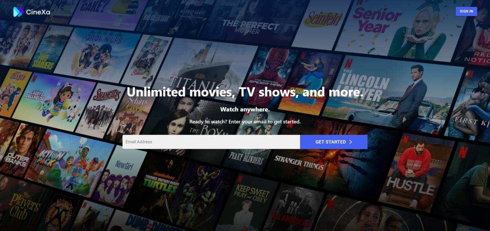

---

### 🔐 Login Page
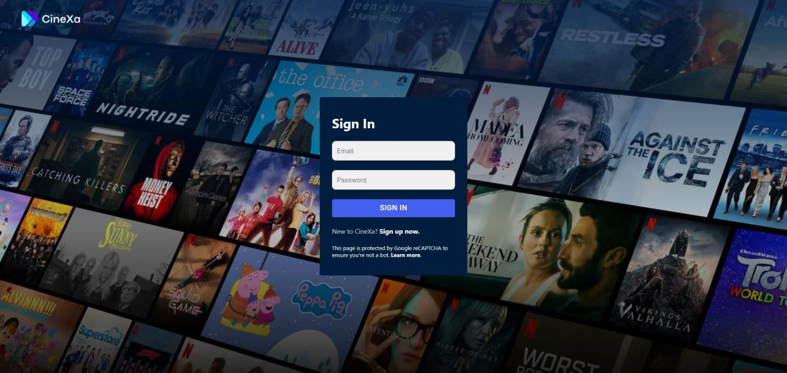

---

### 🏠 Home Page
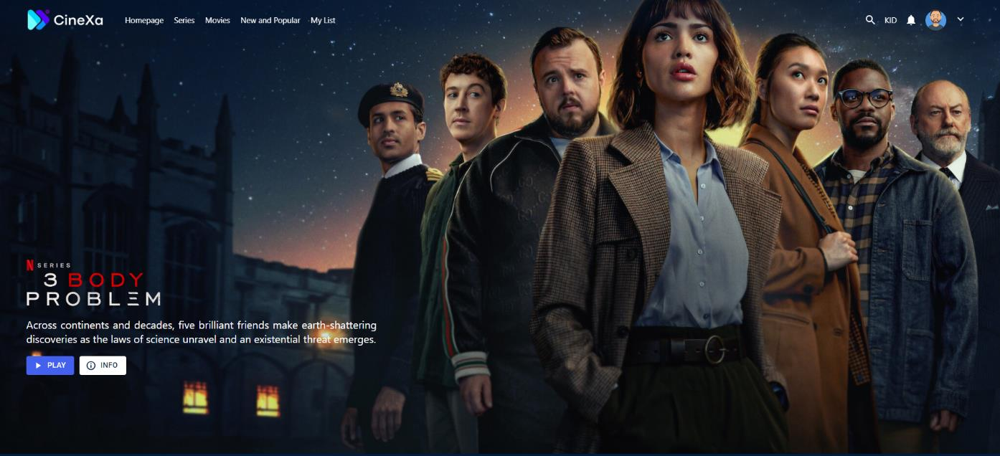

---

### 🧾 Movie Preview 
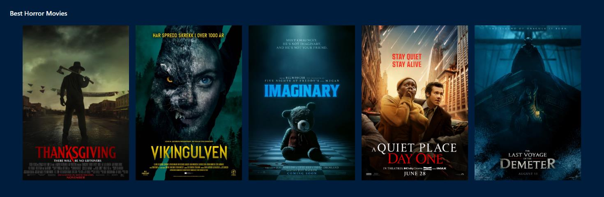
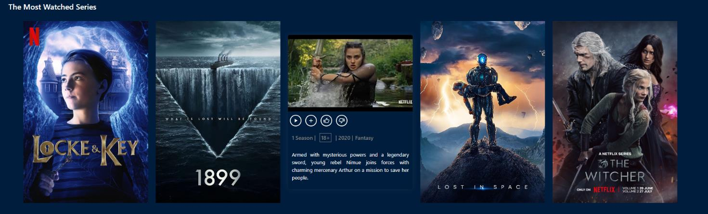

---

### 🎥 Watch Page
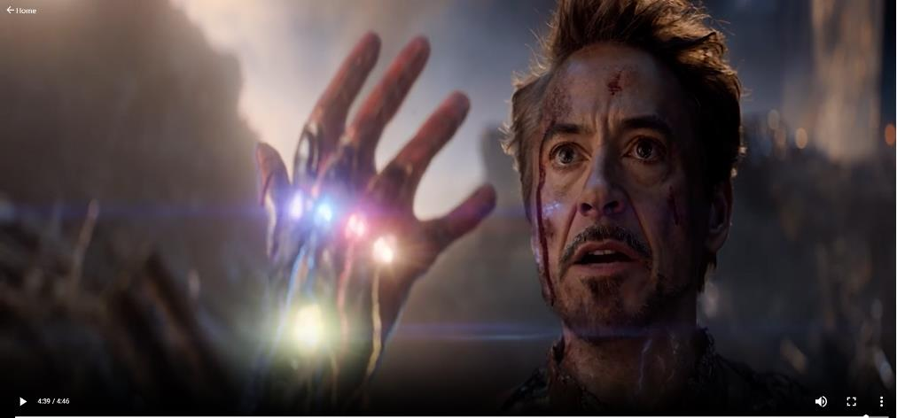

---

### 📱 Responsive UI (Mobile, Tablet)
<p align="center">
  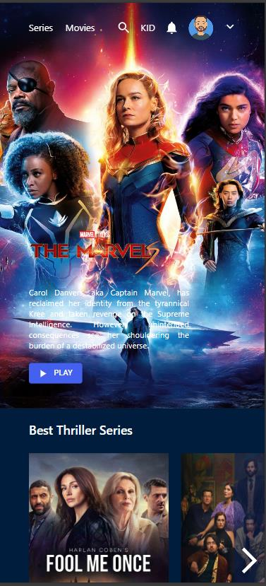
  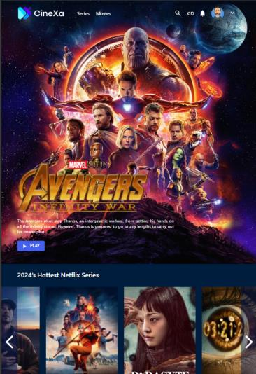
  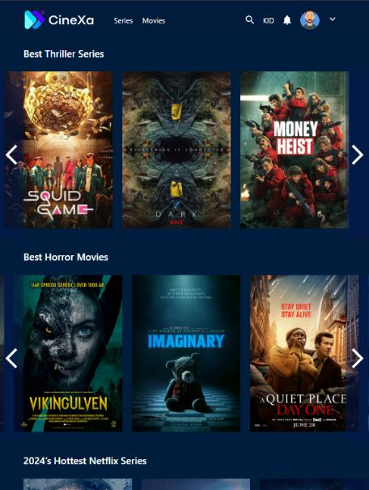
</p>

---

### 🧑‍💻 Admin Dashboard
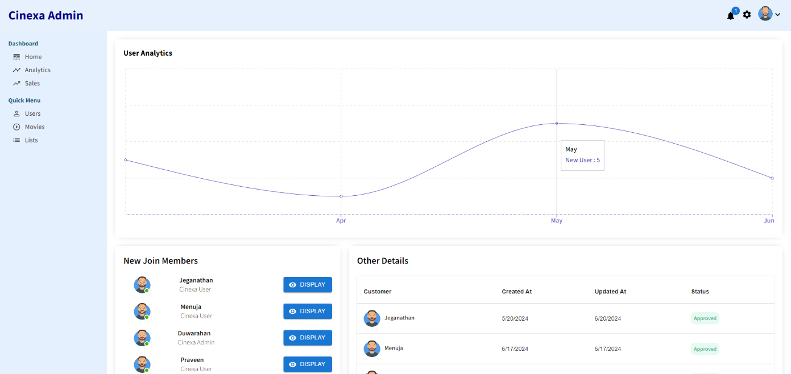

---

### 🎬 All Movies List
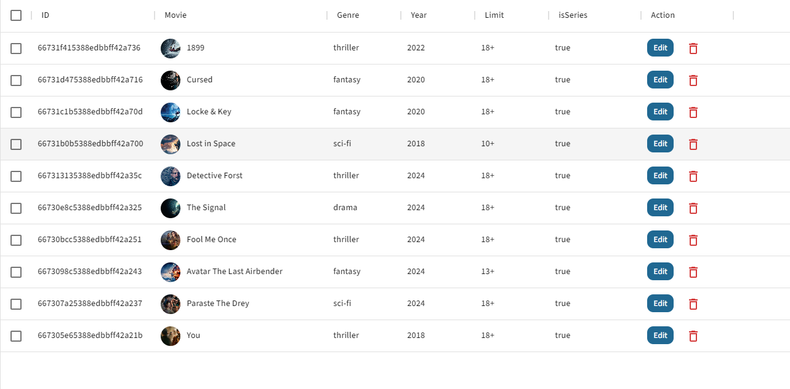

---

### ➕ Add New Movie
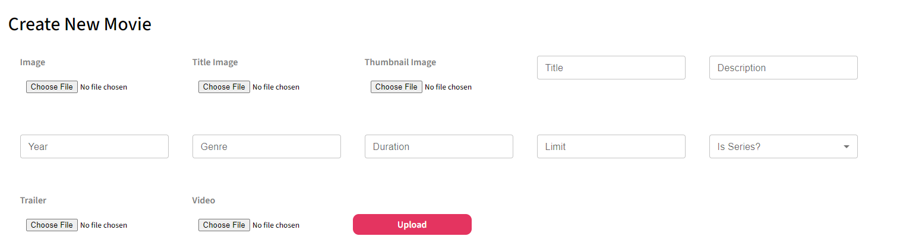

---

### ✏️ Update Existing Movie
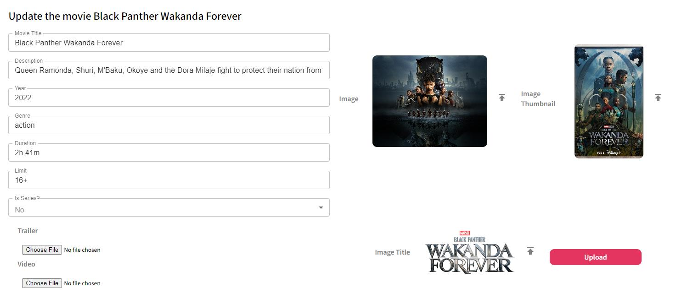


---

## 🌍 Significance

Cinexa demonstrates how modern web technologies can:
- Enhance **entertainment accessibility**
- Support **independent creators**
- Create **job opportunities** in tech and content creation
- Provide **educational content delivery** potential

---

## 🔁 Development Methodology

- 🌀 **Agile Development** with iterative progress  
- 📅 **Scrum Framework** (sprint-based tasks & reviews)  
- 🧪 **API Testing** via Postman  
- 🔄 **Continuous Improvement** using version control

---

## 📜 License

```
MIT License

Copyright (c) 2024 Duwarahavidyan Jeganathan

Permission is hereby granted, free of charge, to any person obtaining a copy
of this software and associated documentation files (the "Software"), to deal
in the Software without restriction, including without limitation the rights
to use, copy, modify, merge, publish, distribute, sublicense, and/or sell
copies of the Software, and to permit persons to whom the Software is
furnished to do so, subject to the following conditions:

The above copyright notice and this permission notice shall be included in all
copies or substantial portions of the Software.

THE SOFTWARE IS PROVIDED "AS IS", WITHOUT WARRANTY OF ANY KIND, EXPRESS OR
IMPLIED, INCLUDING BUT NOT LIMITED TO THE WARRANTIES OF MERCHANTABILITY,
FITNESS FOR A PARTICULAR PURPOSE AND NONINFRINGEMENT. IN NO EVENT SHALL THE
AUTHORS OR COPYRIGHT HOLDERS BE LIABLE FOR ANY CLAIM, DAMAGES OR OTHER
LIABILITY, WHETHER IN AN ACTION OF CONTRACT, TORT OR OTHERWISE, ARISING FROM,
OUT OF OR IN CONNECTION WITH THE SOFTWARE OR THE USE OR OTHER DEALINGS IN THE
SOFTWARE.
```

---

## 👨‍💻 Author

**Duwarahavidyan J.** | 🎓 Undergraduate – Department of Electrical & Information Engineering  
**University of Ruhuna, Sri Lanka**  

🌐 See the full project post and demo on my **[LinkedIn](https://www.linkedin.com/posts/duwarahavidyan-jeganathan-763b6a192_webdevelopment-ottplatform-responsiveui-activity-7326462460893220865-Z5UJ?utm_source=share&utm_medium=member_desktop&rcm=ACoAAC1g0bsBkCY5HOF6iQ3bbHqumfI0SOo0-Dk)**  

💡 *Let’s connect, collaborate, and build amazing tech together!* 🚀


---

### 🌟 Show your support  
If you like this project, don’t forget to ⭐ it on [GitHub](https://github.com/JDuwarahavidyan/Cinexa-A-Modern-OTT-Platform-MERN.git)!
